# BlueMoon: 2021 Penetration Testing Report

## Project Summary
This report documents the penetration testing process on the BlueMoon: 2021 machine. The objective is to simulate a full attack lifecycle including reconnaissance, enumeration, and explanation.
---
## Infrastructure & Tools

- **Target IP**: 192.168.1.120
- **Attacker OS**: Kali Linux

### Tools Used:
  - Nmap
  - Gobuster
  - Firefox
  - Wget
  - Steghide
  - Exiftool
  - Strings
---
## Phase 1: Reconnaissance & Enumeration
### 1. Host Discovery
```bash
nmap -sn 192.168.1.0/24
```
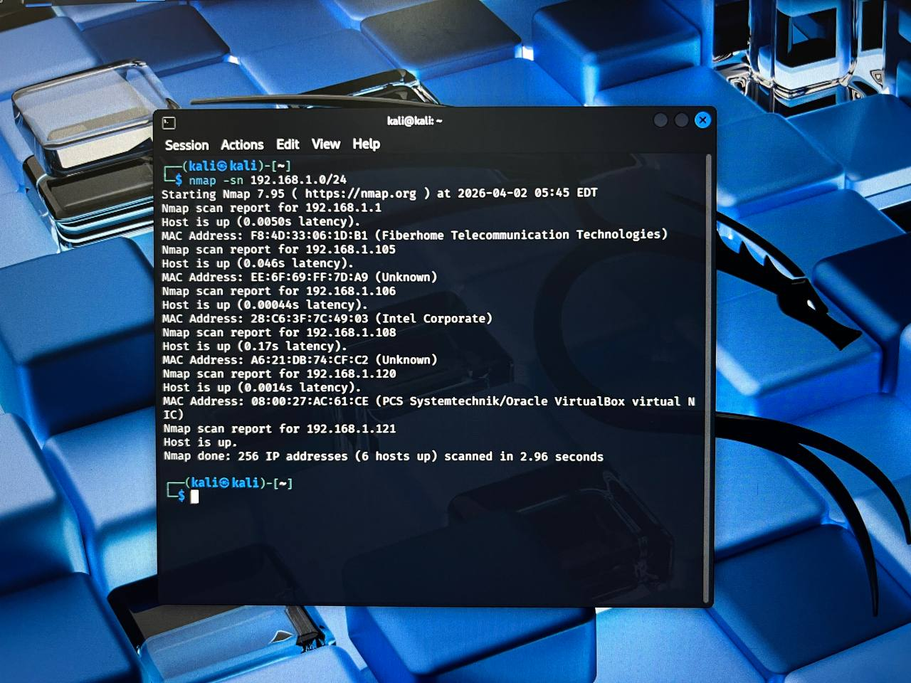

### 2. Port Scanning
```bash
nmap -sC -sV 192.168.1.120
```
**Result:**
- FTP (21)
- SSH (22)
- HTTP (80)
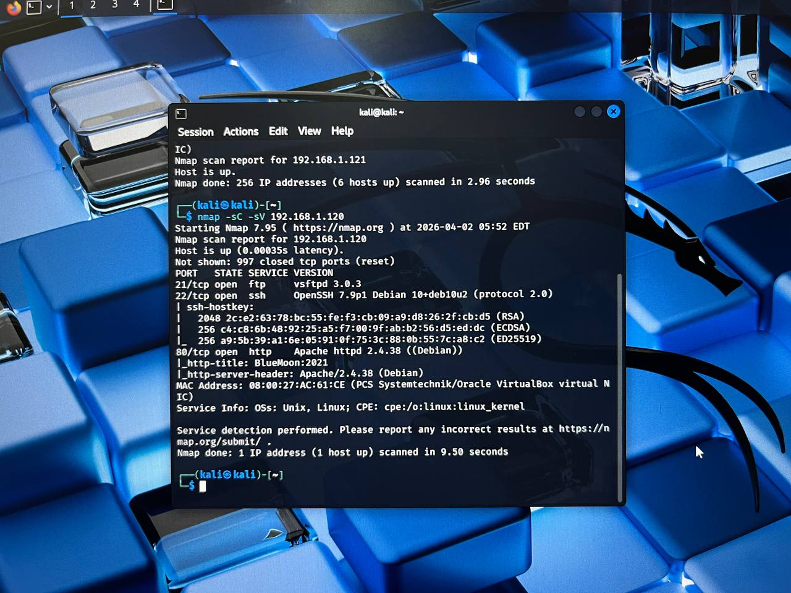

### 3. Directory Enumeration
```bash
gobuster dir -u http//192.168.120 -w /usr/share/wordlists/dirb/common.txt
```
**Found:**
- /index.html
- /server-status (403)
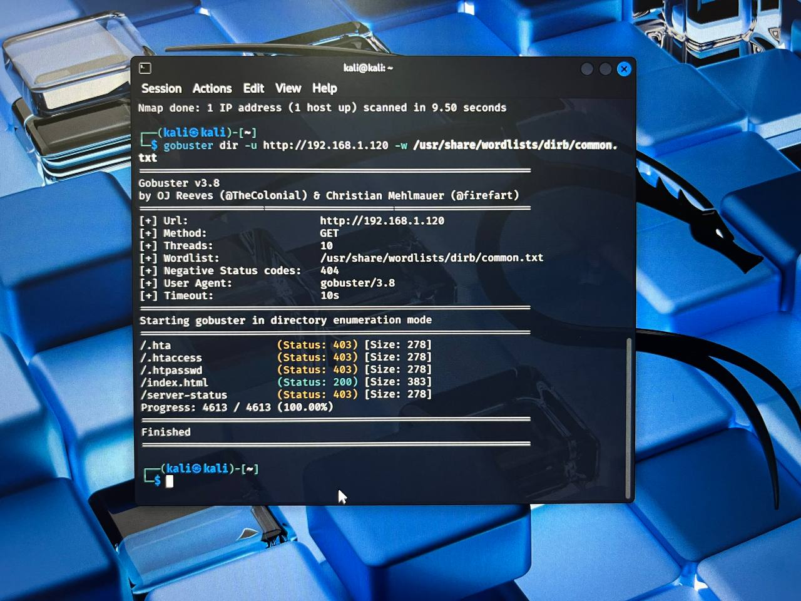

### 4. Web Exploration
Accessed the website using browser:
```bash
firefox http://192.168.1.120
```
Found a message:
- "Are You Ready To Play With Me"
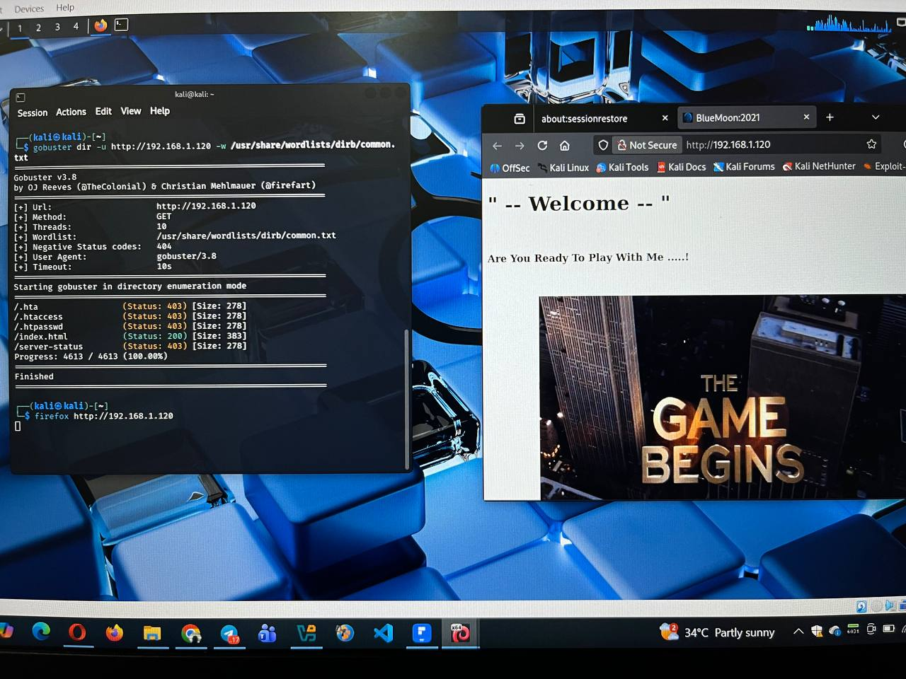

### 5. Source Code Analysis
Viewed page source and found:
- Image: starts.jpeg
- Hidden file: blue.jpg
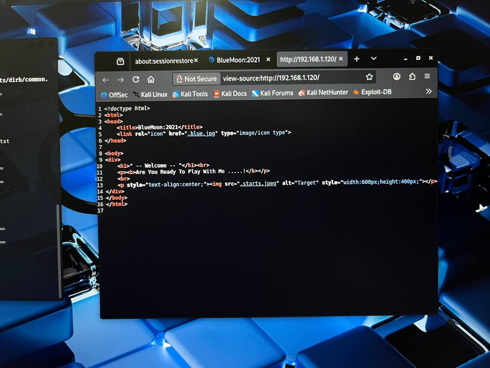

### 6. Download File
```bash
wget http://192.168.1.120/.blue.jpg
```
Renamed file:
```bash
mv .blue.jpg blue.jpg
```
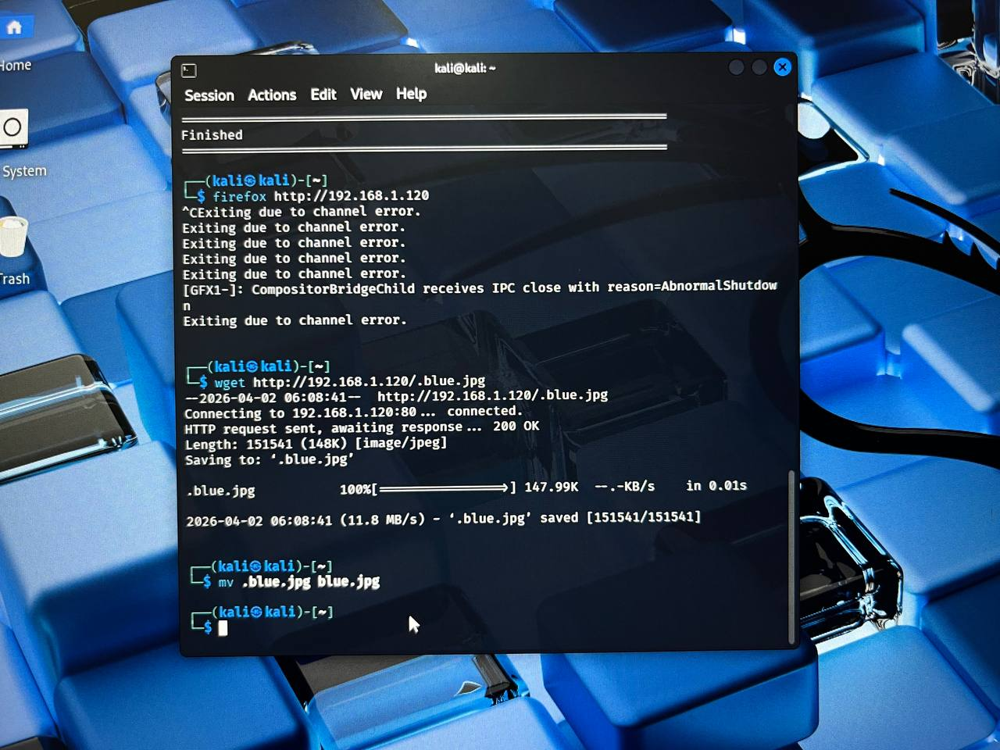

### 7. File Analysis
Checked file type:
```bash
file blue.jpg
```
Extracted strings:
```bash
strings blue.jpg
```
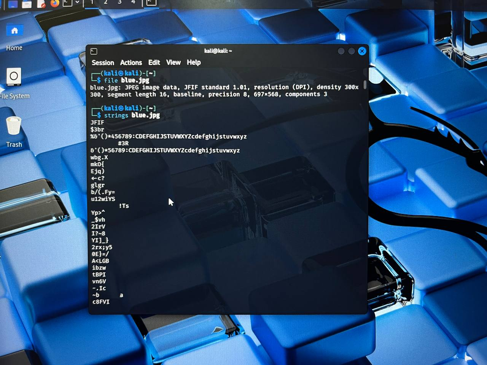

### 8. Metadata Analysis
```bash
exiftool blue.jpg
```
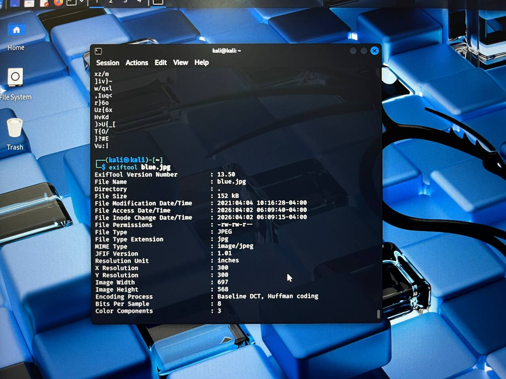

### 9. Steganography Attempt
```bash
steghide info blue.jpg
```
Tried extraction:
```bash
steghide extract -sf blue.jpg
```
Result: Password required
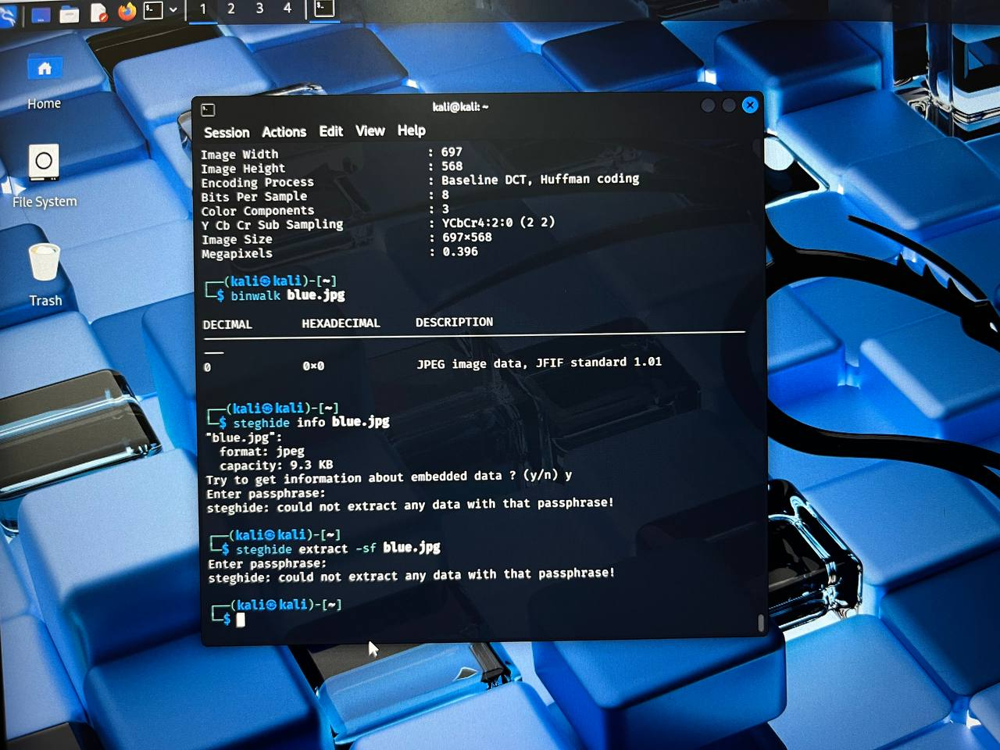

### 10. Password Bruteforce
Used wordlist:
```bash
cat pass.txt
```
Attempted brute force:
```bash
for i in $(cat pass.txt); do steghide extract -sf blue.jpg -p "$i"; done
```
Result: No correct password found
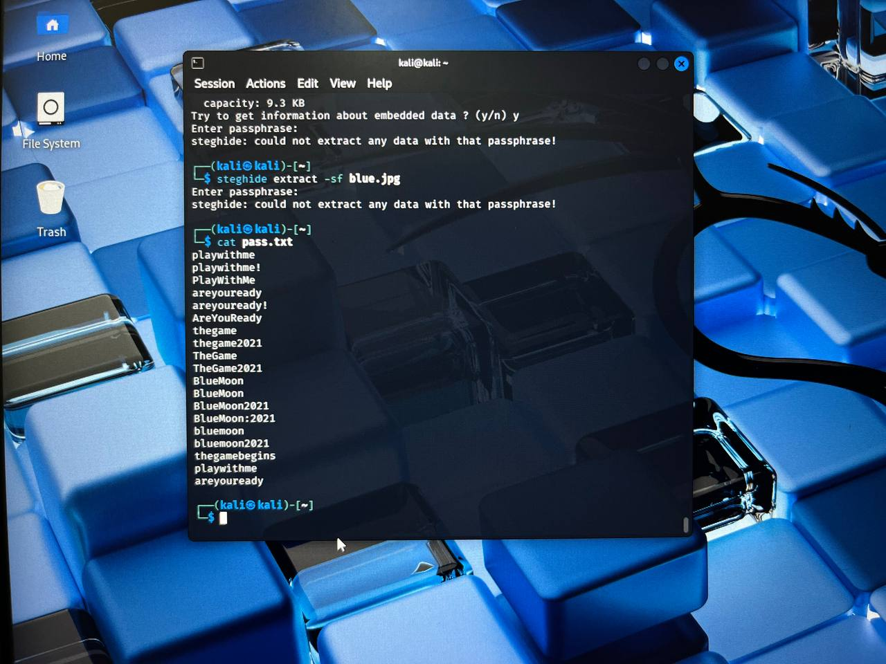
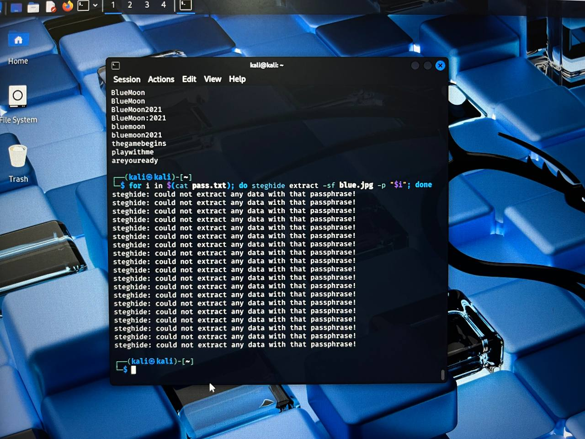

## Conclusion
This penetration testing exercise successfully demonstrated the process of reconnaissance and enumeration on the BlueMoon: 2021 machine.

Several services were discovered including FTP, SSH, and HTTP. Directory enumeration revealed accessible resources, and further investigation led to the discovery of a hidden image file.

Although steganography techniques were applied, the hidden data could not be extracted due to unknown passphrase.

This exercise highlights the importance of enumeration and analysis in penetration testing.****
